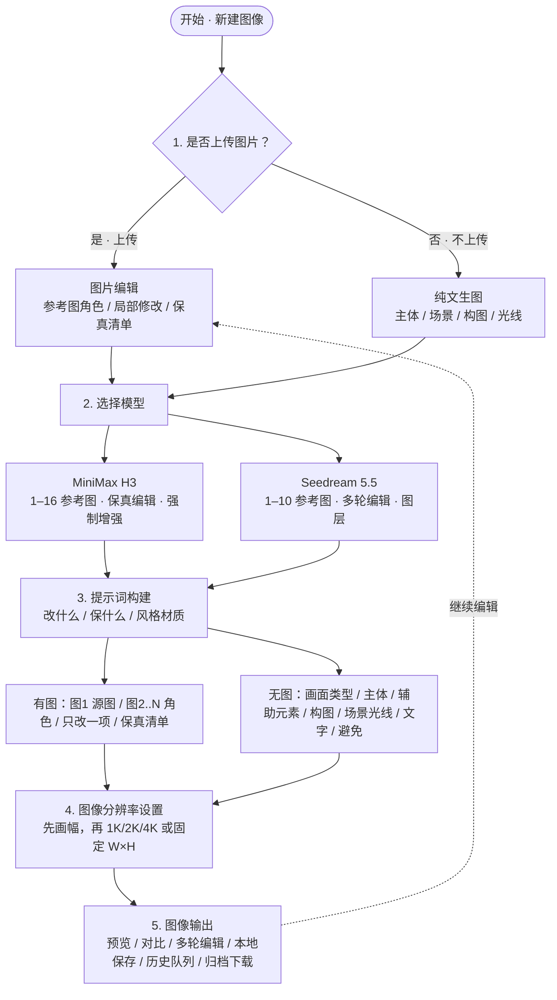

# 图像生成流程图

可编辑源码：

- `docs/diagrams/image-workbench-flow.html`
- 渲染图：`docs/diagrams/image-workbench-flow.png`

```mermaid
flowchart TD
  S([开始 · 新建图像]) --> D{1. 是否上传图片？}
  D -- 是 · 上传 --> A[图片编辑\n参考图角色 / 局部修改 / 保真清单]
  D -- 否 · 不上传 --> B[纯文生图\n主体 / 场景 / 构图 / 光线]
  A --> M[2. 选择模型]
  B --> M
  M --> H[MiniMax H3\n1–16 参考图 · 保真编辑 · 强制增强]
  M --> R[Seedream 5.5\n1–10 参考图 · 多轮编辑 · 图层]
  H --> P[3. 提示词构建\n改什么 / 保什么 / 风格材质]
  R --> P
  P --> P1[有图：图1 源图 / 图2..N 角色 / 只改一项 / 保真清单]
  P --> P2[无图：画面类型 / 主体 / 辅助元素 / 构图 / 场景光线 / 文字 / 避免]
  P1 --> Z[4. 图像分辨率设置\n先画幅，再 1K/2K/4K 或固定 W×H]
  P2 --> Z
  Z --> O[5. 图像输出\n预览 / 对比 / 多轮编辑 / 本地保存 / 历史队列 / 归档下载]
  O -. 继续编辑 .-> A
```
